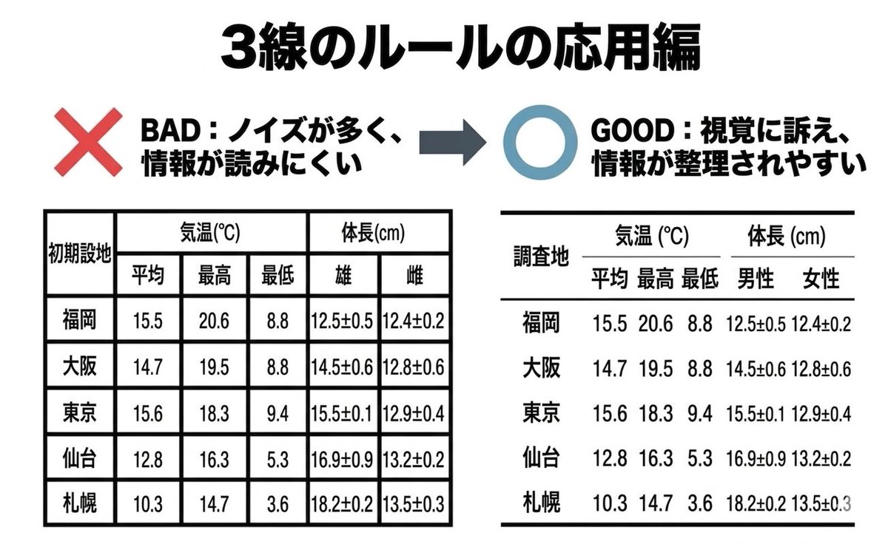

# 情報工学 実験レポート作成ガイドライン

## 変更履歴

| 版  | 日付       | 内容                                                                         |
| --- | ---------- | ---------------------------------------------------------------------------- |
| 1.0 | 2026-04-10 | 初版作成                                                                     |
| 1.1 | 2026-04-13 | 「はじめに」を追加。見出しなどを整形。                                       |
| 1.2 | 2026-04-17 | Tips ページを追加。作図ツール・サイトの紹介を記載。表の書き方に三線表を追記。|
| 1.3 | 2026-04-20 | Tips ページにWindows11でのスクリーンショットの撮り方を追記。                 |

## 1. はじめに
実験レポートは、見た目の綺麗さよりも内容の正確さや他人に理解できることが大切である。
(1)どのような実験を行い (2)どの結果が得られ (3)その結果からどのようなことが考えられるか、明確にわかるように書く必要がある。

## 2. 提出形式と基本フォーマット

### ファイル形式と命名
レポートは **PDF形式** で提出し、ファイル名は「**実験題目_学生番号_氏名.pdf**」とすること。レポート本文はMicrosoft WordまたはGoogle Docs、TeXなどの文書作成ソフトウェアを使用すること。手書きの紙面をスキャンしたものを提出しないこと。

### 用紙とレイアウト
A4片面印刷とし、上下左右に20mmの余白を設けた **1段組み** で執筆する。行間はシングルスペース（1ページあたり約40行）とする。

### フォント指定
和文は **明朝体**、英数文字は **Serif系**（CenturyやTimes New Romanなど）を使用する。

### 文字サイズ
表題は14pt、英題は12pt、学生番号・氏名等は12pt、本文は10.5pt、キャプション（図表の説明）は9ptとする。

## 3. レポートの構成

レポートは、以下の要素を順に含めて論理的に構成すること。

### 表紙
実験題目、学生番号、氏名、実験日を記載する。

### 序論（または目的）
何のための実験か、何を検証・測定するのか、背景となる理論や技術要素を簡潔に述べる。

### 実験
第三者が同じ結果を得られる（再現できる）ように、使用したハードウェア（CPUやメモリ等）やソフトウェア（OS、言語、ライブラリのバージョン等）、および具体的な操作や実施した手順、コマンド、アルゴリズムなど、詳細に記述する。
単なる箇条書き（1. ◯◯する、2. △△する）ではなく、実験の流れを説明する「文章」として構成すること。
これは技術報告書としての体裁を整えるための訓練である。

### 結果
実験で得られた測定値やログ、取得した画面キャプチャ（エビデンス）など、**事実のみを客観的に記述する**。動作ログなどが大量にある場合は、適切かつ適量とすること。必要な部分を抜粋し、体裁を整える技術を養う。

### 考察
結果が予想と一致したか、不一致ならその理由は何かを分析する。手法の比較、誤差の原因、計算効率（時間・空間計算量）などについて論理的に検討する。感想を書く場所ではない。結果と分けて書きにくい場合、「結果と考察」としてまとめても良い。

### 結論
序論で掲げた目的に対する回答を端的に述べる。

### 課題に対する答え
課題が設定されている実験には、それに対する答えを記す。

### 参考文献
詳細は後述のルールに従うこと。

## 4. 文章の書き方・図表・数式

- 文体:

  「〜である」「〜した」の **常体** で統一し、主観的・感情的な表現は避ける。箇条書きは多用せず、また箇条書きの末尾には句点（。）を打たない。

- 図表の配置:

  本文と独立した行に配置し、テキストの回り込みはさせず、本文との間に1行の空白を空ける。表が複数ページに分かれる場合は、次ページの先頭にもキャプションを入れ「(つづき)」と記載する。

- キャプションと参照:

  本文中では必ず「図1に示す通り」と参照する。図の番号と説明は **図の下**、表は **表の上** に記載する。

- 表の書式:

  表は原則として **三線表** を用いる。罫線は「上罫線・見出し下罫線・下罫線」の3本を基本とし、縦罫線や過剰な横罫線は避ける。例を図1に示す。

  

  図1 三線表の例（参照元: <https://x.com/tokei389950/status/2041090174067634509>, 参照日: 2026-04-17）

- グラフ:

  軸ラベル（項目名と単位）を明記し、白黒印刷でも線の違いが判別できる表現を心がける。

- 数式と単位:

  原則としてSI単位を用い、数値と単位の間には1つのスペースを入れる。単位記号は **ローマン体（立体）**、量記号等は **イタリック体** とする。数式は本文から1行以上空けて配置し、右端に「(1)」のように式番号を付ける。

- 数値:

  計算機の出力した多桁の数値をそのまま載せず、有効数字を考慮して適切な桁数に丸める。

## 5. 情報分野特有の注意点（コード・AI・倫理）

### ソースコード
重要な箇所を抜粋し、等幅フォント（Consolasなど）を用いてインデントを崩さずに記載する。単なる貼り付けで済ませず、アルゴリズムの工夫点などを本文中で解説すること。

### 生成AIの利用
生成AIの技術を理解した上で、ツールとして使いこなすことを妨げるものではない。ただし、AIの回答のすべてまたはその一部をそのまま貼り付けることは厳禁である。補助的に利用した場合は、利用したAIの名称、プロンプト（指示文）、利用箇所を「付記」として明記する。

### 研究倫理と失敗の扱い
剽窃（インターネット上のコードの無断盗用）やデータの捏造・改ざんは厳禁である。外部コードを利用する際はライセンス（MIT等）を確認し、適切に引用すること。実験が失敗した場合もデータを改ざんせず、原因を論理的に考察で説明すること。他人のレポートの盗用は高専の不正行為と同等の扱いとする。

## 6. 参考文献のルール

参考にした書籍やWebサイトのURL等を記述する。
リストアップするだけでなく、**必ず本文中の参考にした箇所で参考文献番号を用いて参照すること**。

### 引用方法
引用箇所の右肩に「(1)」や「(1, 4)」のように通し番号を付ける。
### 書式
末尾に「(通し番号) 著者、タイトル、掲載誌名、巻数、号数、掲載年、ページ数」の順でまとめる。

#### 書籍の場合

`著者名, 『書名』, 出版社, 出版年。`

#### Webサイトの場合

`著者/組織名, "ページタイトル", URL, (参照日: 202X-XX-XX)。`

URLだけを貼るのは不適切である。
Webサイトを参考文献とするのは、ソースコードなど書籍・記事には不向きなものに限る。

### 注意
学内限定の「実験指導書」は参考文献に含めないこと。

## 7. 発展: さらに高い評価を得るためのポイント

将来の論文執筆等を見据え、以下を取り入れることを推奨する。

### 概要（Abstract）の導入
レポート冒頭に、300字程度で「何をして何が分かったか」の要約を記載する。

### 図表の独立性確保
「本文を読まなくても、図表とキャプションだけで内容が概ね理解できる」よう、説明を詳しく記述する。

### 今後の展望（Future Work）
「今回の条件では検証できていないこと」「今後は△△を試す必要がある」といった限界と展望を記述し、誠実な科学的態度を示す。

## 8. 最終確認（推敲）

提出前に、図表や数式の番号が本文の説明とズレていないか、誤字脱字がないか、指定されたPDF形式・ファイル名になっているかを必ず確認すること。google classroomで提出する場合は送信（提出）ボタンをクリックすることを忘れないこと。
