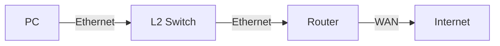

# 作図

レポートにネットワーク図・構成図・フローチャートなどを掲載する際には、以下のツールを活用するとよい。

## draw.io（diagrams.net）

**URL:** <https://app.diagrams.net/>

ネットワーク図・フローチャート・ER図など幅広い図を作成できる無料のWebアプリ。ローカルのデスクトップアプリ版（Electron製）も配布されている。作成したファイルは `.drawio`（XML）形式で保存でき、PNG・SVG・PDFへのエクスポートも可能。Google Drive・OneDrive・GitHubとの連携にも対応している。ネットワーク機器アイコンなどのシェイプライブラリが豊富で、実験レポートで頻出するネットワーク構成図を作成しやすい。

## Lucidchart

**URL:** <https://www.lucidchart.com/>

フローチャート・ネットワーク図・UMLなどを作成できるWebベースのツール。無料プランでは編集できるドキュメント数などに制限があるが、基本的な作図機能は利用可能。複数人でのリアルタイム共同編集に対応しており、チームでのレポート作成に適している。

## Mermaid

**URL:** <https://mermaid.live/>

テキスト（コード）から図を生成するオープンソースのダイアグラム記述言語。フローチャート・シーケンス図・ガントチャートなどをMarkdown内に直接埋め込める。`mermaid.live` はブラウザ上でリアルタイムにプレビューできるエディタである。本ガイドラインのMkDocsサイト（Material テーマ）でもMermaidによる図の描画に対応している。

## PlantUML

**URL:** <https://www.plantuml.com/plantuml/>

テキストからUMLダイアグラムや各種構成図を生成できるオープンソースツール。シーケンス図・クラス図・ネットワーク図（`nwdiag`）などに対応している。Javaランタイムがあればローカルでも利用可能。VSCodeの拡張機能（PlantUML）を使うと、エディタ上でプレビューしながら作図できる。

## Cisco Packet Tracer

**URL:** <https://www.netacad.com/courses/packet-tracer>（要Cisco NetAcadアカウント・無料）

Ciscoが提供するネットワークシミュレータ。ルータやスイッチなどネットワーク機器を視覚的に配置・設定し、パケットの動作を確認できる。ネットワーク構成図の作成だけでなく、実際の動作確認・学習にも使える。

## GNS3

**URL:** <https://www.gns3.com/>

本格的なネットワークエミュレータのオープンソースソフトウェア。実機に近い環境でルータやスイッチの設定を試せる。Cisco IOSなどの実機イメージを別途用意する必要があるが、ネットワーク構成図を作成しつつ動作確認まで行いたい場合に有用である。

## Microsoft Visio / PowerPoint

Microsoft Visioはネットワーク図・フローチャート作成に特化した商用ツールであり、多くの企業・組織での標準ツールとなっている（有償）。手軽な代替として、Microsoft PowerPointのSmartArtや図形機能を使って構成図を描く方法も広く用いられている。大学などのライセンスで利用できる場合は積極的に活用するとよい。

## ツール選択の目安

| ツール              | 形式               | 費用             | 用途                                 |
| ------------------- | ------------------ | ---------------- | ------------------------------------ |
| draw.io             | Web / デスクトップ | 無料             | ネットワーク図・フローチャート全般   |
| Lucidchart          | Web                | 無料（制限あり） | チーム共同作業                       |
| Mermaid             | テキスト（コード） | 無料             | Markdown文書への埋め込み             |
| PlantUML            | テキスト（コード） | 無料             | UML・シーケンス図                    |
| Cisco Packet Tracer | デスクトップ       | 無料（要登録）   | ネットワーク構成・シミュレーション   |
| GNS3                | デスクトップ       | 無料             | 本格的なネットワークエミュレーション |
| Microsoft Visio     | デスクトップ       | 有償             | 業務・標準的なネットワーク図         |
